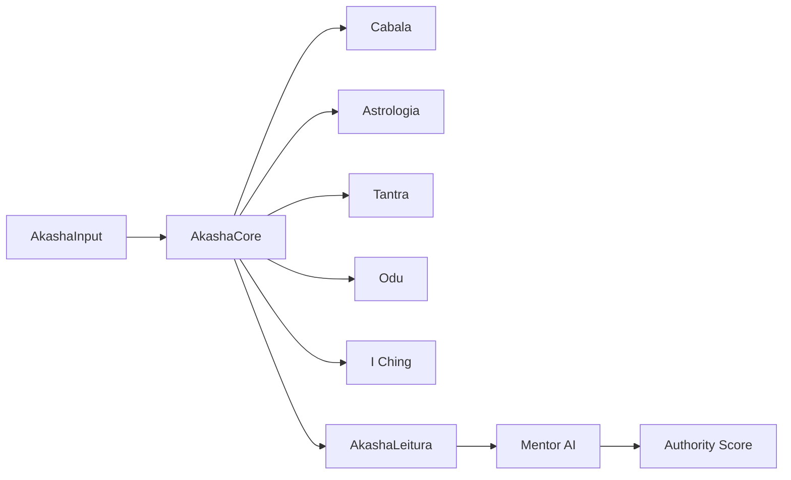

# Arquitetura

> **🚧 Em construção** — esta seção será populada pela **Wave 15.2**.

A arquitetura do Akasha Portal será detalhada aqui, cobrindo:

- **Os 5 Pilares** — Cabala, Astrologia, Tantra, Odu, I Ching — e como o
  `@akasha/core` orquestra o cálculo e a correlação.
- **AkashaLayout** — shell do portal, navegação contextual, e estado
  de leitura atual.
- **Integração MCP** — Model Context Protocol para tools externas
  (calendário, geolocalização, bases esotéricas).
- **Pipeline RAG** — Retrieval-Augmented Generation do Mentor AI.
- **Diagrama de componentes** — renderizado via Mermaid.

## Diagramas (preview)

Veja a página completa em breve.
