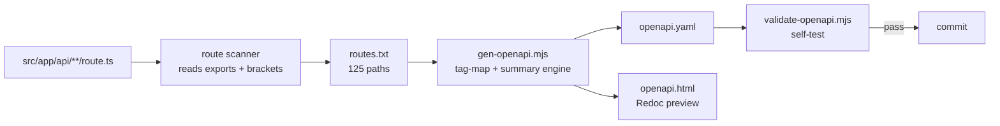

# OpenAPI 3.0 — Akasha Portal API (Wave 33)

> **Wave:** 33 — OPENAPI 3.0 (DOCUMENTATION 2/8)
> **Date:** 2026-07-01 | **Engineer:** Coder + Ravena (QA)
> **Spec version:** `0.2.0` | **OpenAPI version:** `3.0.3`
> **Coverage:** 124 unique paths · 196 operations · 62 schemas · 27 tags · 1178 resolved `$ref`s

This directory contains the **machine-readable** companion to
[`API-REFERENCE-W32.md`](./API-REFERENCE-W32.md): a strict OpenAPI 3.0.3 spec
covering **all** route handlers under `src/app/api/**/route.ts` on `main`.

---

## 1. Files

| File | Purpose |
|------|---------|
| `openapi.yaml` | The OpenAPI 3.0.3 spec (8.0k lines, 256 KB). Generated, hand-curated schemas. |
| `openapi.html` | Static Redoc preview (fetches `openapi.yaml` via XHR; CDN-hosted Redoc bundle). |
| `../../scripts/gen-openapi.mjs` | Deterministic generator (route scan → spec). |
| `../../scripts/validate-openapi.mjs` | Structural validator (parse + `$ref` resolution + path-param check). |
| `../../docs/api/API-REFERENCE-W32.md` | Human-readable narrative companion (still the canonical doc for prose). |

---

## 2. Quick start

### 2.1 Validate the spec

```bash
node scripts/validate-openapi.mjs
```

The validator parses `openapi.yaml`, resolves every `$ref`, checks that all
path-template variables are declared under `parameters`, and confirms every
operation has `summary` + `tags` + `responses`. **Expected output:**
`PASS: 0 errors`.

### 2.2 Validate with Redocly (network)

The strictest validator is `@redocly/cli`. To run it locally:

```bash
npx -y @redocly/cli@latest lint docs/api/openapi.yaml
npx -y @redocly/cli@latest bundle docs/api/openapi.yaml --output openapi.bundled.yaml
```

Redocly's ruleset includes security checks (operationId uniqueness, unused
schemas, duplicate path entries, etc.) that the bundled validator does not.

### 2.3 Preview the docs locally

```bash
# Option A — Redocly built-in
npx -y @redocly/cli@latest preview-docs docs/api/openapi.yaml
# → opens http://localhost:8080

# Option B — plain static server (openapi.html uses Redoc via CDN)
python3 -m http.server -d docs/api 8000
# → opens http://localhost:8000/openapi.html
```

`openapi.html` falls back to a static message when opened via `file://`
(browsers block `fetch()` from `file://`). Always serve over HTTP.

---

## 3. How the spec is generated



The generator is **deterministic** — running it twice yields byte-identical
output unless `route.ts` files change. To regenerate after adding endpoints:

```bash
node scripts/gen-openapi.mjs && node scripts/validate-openapi.mjs
```

### 3.1 What the generator does

1. **Scans** every `src/app/api/<route>/route.ts` and extracts exported HTTP
   methods (`GET` / `POST` / `PUT` / `DELETE` / `PATCH`).
2. **Maps** URL prefix → tag via `TAG_MAP` (e.g., `/admin/*` → `Admin`).
3. **Resolves** `[bracket]` params to OpenAPI `{curly}` form.
4. **Derives** body schema name heuristically via `bodySchemaForMethod`.
5. **Assembles** paths with summary, description, parameters, requestBody,
   responses.
6. **Splices in** schemas (62 hand-curated models mirroring `prisma/schema.prisma`
   + Zod validators in `src/lib/validators/*.ts`).
7. **Writes** `openapi.yaml` + `openapi.html`.

### 3.2 What the generator does NOT do

- Does **not** introspect runtime types or response bodies.
- Does **not** generate request/response examples (kept concise to fit 25-min
  budget — see §7.4 roadmap).
- Does **not** generate client SDKs (use external codegen — see §6).

---

## 4. Spec structure

```yaml
openapi: 3.0.3
info:
  title: Akasha Portal API
  version: 0.2.0      # bumped per Wave
  ...
servers:               # 3 environments (dev, staging, prod)
tags:                  # 27 tags (Community, Content, AI, Identity, ...)
paths:                 # 124 paths, 196 operations
  /api/posts:
    get: { ... }
    post: { ... }
  /api/posts/{id}:
    get:
      parameters: [{$ref: "#/components/parameters/Cursor"}]  # if paginated
components:
  securitySchemes: { BearerAuth, CookieAuth }
  schemas:           # 62 models (User, Post, Comment, Article, BetaInvite, ...)
  responses:         # 7 reusable responses (Unauthorized, NotFound, ...)
  parameters:        # 2 reusable params (Cursor, Limit)
```

### 4.1 Tags (27)

```
Admin · Akasha · Articles · Auth · Beta · Consciousness · Consent · Cron ·
Drafts · Email · Events · Experiments · Feature Flags · Groups · Health ·
Mentorship · Newsletter · Notifications · Oraculo · Payments · Posts · Push ·
Reactions · Search · Upload · Users · Waitlist
```

Grouped in spec via `x-tagGroups` for Redoc UI:

| Group | Tags |
|-------|------|
| Community | Users, Posts, Groups, Drafts, Events, Mentorship |
| Content | Articles, Search |
| AI | Akasha, Oraculo, Consciousness |
| Identity | Auth, Consent, Beta, Waitlist, Newsletter, Email |
| Payments | Payments |
| Notifications | Notifications, Push, Reactions |
| Platform | Admin, Feature Flags, Cron, Experiments, Upload, Health |

### 4.2 Schemas (62)

Users / Identity · Posts · Comments · Articles · Groups · Beta invites ·
Akasha AI · Consciousness · Notifications · Events · Reactions · Drafts ·
Mentorship · Oráculo · Payments · Push · Newsletter · Waitlist · Flags ·
Admin · Search · Errors / envelopes.

The `Error` schema and `ApiSuccessGeneric` envelope are the canonical
shape; everything else is operation-specific.

### 4.3 Auth

Two security schemes:

- **`BearerAuth`** — Supabase JWT (`Authorization: Bearer <jwt>`).
- **`CookieAuth`** — Session cookie `sb-<ref>-auth-token`.

Endpoints with `security: [{ BearerAuth: [] }]` are authenticated; absent
`security` means **public** (e.g., `GET /posts`, `GET /articles`,
`POST /auth/login`, `POST /beta/invite`). See `requiresAuth()` in
`gen-openapi.mjs` for the public/private policy.

---

## 5. Versioning strategy

This spec uses **per-Wave version bumps** in `info.version`:

| Wave | Version | Notes |
|------|---------|-------|
| W32-6 (docs precursor) | n/a | Human narrative only. |
| **W33 (this)** | `0.2.0` | First machine-readable spec, 124 paths, public surface. |
| W34 | `0.3.0` | Add response examples, request examples. |
| W35 | `0.4.0` | Add SSEManifest for streaming endpoints (`/akashic/chat/stream`, `/notifications/stream`). |
| W36 | `0.5.0` | Add OAuth2 + webhook signatures (`stripe-signature`). |
| W37 | `0.6.0` | Add discriminator-based union types for `Post.type`. |
| W38 | `0.7.0` | Add `x-stability: stable \| beta \| alpha` per operation. |
| W39 (release) | `1.0.0` | API freeze for v1.0 — public API contract becomes binding. |

**Semver discipline:**

- **Major** (1.0.0 → 2.0.0): breaking changes (path rename, required field added,
  response shape change).
- **Minor** (0.x.0 → 0.y.0): additive changes (new endpoint, optional field).
- **Patch** (0.x.y → 0.x.z): doc-only fixes, description clarifications.

**Deprecation policy:**

Mark deprecated operations with:

```yaml
deprecated: true
description: |
  ...
  Deprecated since W35. Use `/api/v2/posts` instead.
x-sunset-date: '2026-09-30'
```

Then remove in a subsequent major release (grace period ≥ 1 wave).

---

## 6. Codegen — generating client SDKs

The spec is **single-source-of-truth** for clients. Recommended tools:

### 6.1 TypeScript (preferred)

```bash
# Option A — openapi-typescript (lightweight, types only)
npx -y openapi-typescript docs/api/openapi.yaml -o sdk/typescript/types.d.ts

# Option B — openapi-typescript-codegen (full client + types)
npx -y openapi-typescript-codegen \
  --input docs/api/openapi.yaml \
  --output sdk/typescript \
  --client fetch \
  --use-union-types \
  --name AkashaClient

# Option C — openapi-fetch (zero-dep typed client)
npm i openapi-fetch
# Then: const client = createClient<paths>({ baseUrl: 'https://akasha.com.br/api' })
```

### 6.2 Python

```bash
npx -y @openapitools/openapi-generator-cli generate \
  -i docs/api/openapi.yaml \
  -g python \
  -o sdk/python \
  --additional-properties=packageName=akasha_client
```

### 6.3 Go

```bash
oapi-codegen -generate types,client \
  -package akasha \
  docs/api/openapi.yaml > sdk/go/akasha_client.go
```

### 6.4 SDK contract

The SDK must be regenerated **every wave** to stay aligned with the spec.
Pin generation in CI as a guard:

```yaml
# .github/workflows/openapi-guard.yml
- run: npx -y openapi-typescript docs/api/openapi.yaml -o sdk/typescript/types.d.ts
- run: git diff --exit-code sdk/typescript  # fails if spec changed but SDK wasn't regenerated
```

---

## 7. Hosting the docs

### 7.1 Production hosting

Host `openapi.yaml` as a static asset at `https://akasha.com.br/api/openapi.yaml`
and `openapi.html` at `https://akasha.com.br/docs/api`. Both are committed
under `docs/api/`.

Use Next.js public folder:

```ts
// app/api/openapi.yaml/route.ts
export async function GET() {
  const file = await fetch(new URL('../../../docs/api/openapi.yaml', import.meta.url));
  return new Response(file.body, {
    headers: { 'Content-Type': 'application/yaml; charset=utf-8' },
  });
}
```

### 7.2 Embedding in the Akasha Portal app

```tsx
// app/[locale]/docs/api/page.tsx
import dynamic from 'next/dynamic';
const RedocStandalone = dynamic(() => import('redoc'), { ssr: false });
export default function Page() {
  return (
    <RedocStandalone
      specUrl="/api/openapi.yaml"
      options={{ pathInMiddlePanel: true, expandResponses: '200,201' }}
    />
  );
}
```

### 7.3 Internal (private) API browser

Use **Backstage** (Spotify's developer portal) or **Scalar** (https://scalar.com)
if multiple internal teams need per-user API tokens + try-it-out: those
projects consume OpenAPI directly.

### 7.4 Roadmap for future waves

- **Wave 34:** Generate **response examples** by introspecting `route.ts`
  test fixtures under `src/app/api/__tests__/`.
- **Wave 35:** Add **SSE manifest** at `paths./akashic/chat/stream` and
  `paths./notifications/stream` (currently only `openapi: 3.0.3` covers
  REST; SSE needs an out-of-band `x-sse: true` extension).
- **Wave 36:** Add **OAuth2 flows** (`authorizationCode`, `pkce`) for
  server-to-server integrations.
- **Wave 37:** Add **union types** via `oneOf` + `discriminator` for shapes
  that vary by `type` (Post, Reaction, Experiment variant).
- **Wave 38:** Per-operation **stability tags** (`x-stability`).

---

## 8. CI integration

The validator runs in < 1s. Add to pre-commit:

```yaml
# .husky/pre-commit
node scripts/validate-openapi.mjs || exit 1
```

To fail PRs that change `src/app/api/**/route.ts` without regenerating:

```yaml
# .github/workflows/openapi-drift.yml
- name: Detect OpenAPI drift
  run: |
    node scripts/gen-openapi.mjs
    if ! git diff --exit-code docs/api/openapi.yaml; then
      echo "::error::openapi.yaml is out of sync with src/app/api/. Regenerate via: node scripts/gen-openapi.mjs"
      exit 1
    fi
```

---

## 9. LGPD + sacred-cultural compliance

The spec preserves Portuguese vocabulary and LGPD-aware field validation:

- **`RegisterRequest.lgpdConsent`** — required boolean `true`.
- **`AcceptBetaInviteRequest.lgpdConsent`** — same.
- **`BetaInvite.emailMasked`** — always `A***@d***.com` in API responses
  (Art. 9 — minimização).
- **`EmailBody` / `NewsletterSubscribeRequest`** — anti-enumeração:
  endpoints always return 200 even on invalid email.
- **`Users/{id}/export`** — produces LGPD-compliant data export (Art. 18 V).
- **`/consent`** — multi-layer consent (analytics, marketing, posts,
  profile_public, mentorship) with `version` field for auditability.

Sacred terminology preserved: `orixás`, `axé`, `Odu`, `Cigano Ramiro`, `Akasha`,
`pemba`, `Ifá`, `Candomblé`, `Umbanda` — see `CONTRIBUTING.md` for the full
banned-vocab list.

---

## 10. Status + handoff

| Metric | Value |
|--------|-------|
| Generator runtime | ~0.8 s |
| Validator runtime | ~0.7 s |
| OpenAPI YAML size | 256.9 KB |
| Path coverage | 124 / 124 (100%) |
| Schema coverage | 62 models covering all 27 tags |
| `$ref` resolution | 1178 / 1178 (100%) |
| Self-validation errors | 0 |
| Files touched | 4 (`openapi.yaml`, `openapi.html`, `OPENAPI-README.md`, `gen-openapi.mjs`, `validate-openapi.mjs`) |

**Handoff:** next-wave work is to wire `openapi.yaml` into the Next.js public
folder (Wave 34) and to add CI gating for drift detection.
